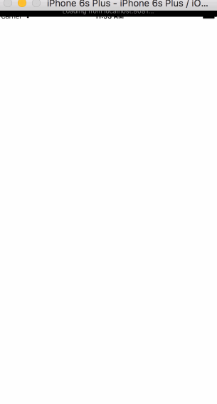

# Basic Color Animation

We'll do this animation 2 different ways. One just the color, the other is interpolating from the position.

## Just color changing

#### Live Code [https://rnplay.org/apps/MW3vBQ](https://rnplay.org/apps/MW3vBQ)




```
var React = require('react-native');
var {
  AppRegistry,
  StyleSheet,
  Text,
  View,
  Animated
} = React;

var SampleApp = React.createClass({
  
  componentWillMount: function() {
    this._animatedValue = new Animated.Value(0);
  },
  componentDidMount: function() {
    Animated.timing(this._animatedValue, {
        toValue: 100,
        duration: 3000
    }).start();    
  },
  render: function() {
    
    var interpolatedColorAnimation = this._animatedValue.interpolate({
    	inputRange: [0, 100],
      outputRange: ['rgba(255,255,255, 1)', 'rgba(51,156,177, 1)']
    });
    
    return (
      <View style={styles.container}>
       <Animated.View 
      		style={[styles.box, {backgroundColor: interpolatedColorAnimation}]}
      	/>
      </View>
    );
  }
});

var styles = StyleSheet.create({
  container: {
    flex: 1
  },
  box: {
    position: 'absolute',
    top: 100,
    left: 100,
    width: 100,
    height: 100
  }
});

AppRegistry.registerComponent('SampleApp', () => SampleApp);

```

## Interpolate on movement

Alright well this is literally just combining the previous Moving square demo into this.

The simple change we need to make is just on the `Animated.View` to add back our translate.

```
       <Animated.View 
      		style={[styles.box, {backgroundColor: interpolatedColorAnimation, transform: [{translateY: this._animatedValue}]}]}
      	/>
```

#### Live Code [https://rnplay.org/apps/uYfMpA](https://rnplay.org/apps/uYfMpA)