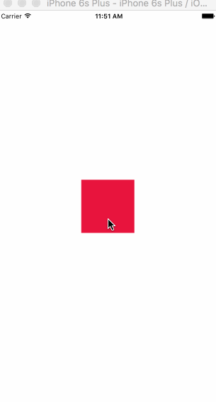

# Drag Square Animation

#### Live Code [https://rnplay.org/apps/m_t0yQ](https://rnplay.org/apps/m_t0yQ)




```
var React = require('react-native');
var {
  AppRegistry,
  StyleSheet,
  View,
  PanResponder,
  Animated
} = React;

var SampleApp = React.createClass({
  
  componentWillMount: function() {
    this._animatedValue = new Animated.ValueXY()
    this._value = {x: 0, y: 0}
    
    this._animatedValue.addListener((value) => this._value = value);
    this._panResponder = PanResponder.create({
        onMoveShouldSetResponderCapture: () => true, //Tell iOS that we are allowing the movement
        onMoveShouldSetPanResponderCapture: () => true, // Same here, tell iOS that we allow dragging
        onPanResponderGrant: (e, gestureState) => {
          this._animatedValue.setOffset({x: this._value.x, y: this._value.y});
          this._animatedValue.setValue({x: 0, y: 0});
        },
        onPanResponderMove: Animated.event([
          null, {dx: this._animatedValue.x, dy: this._animatedValue.y}
        ]), // Creates a function to handle the movement and set offsets
        onPanResponderRelease: () => {
          this._animatedValue.flattenOffset(); // Flatten the offset so it resets the default positioning
        }
      });
  },
  render: function() {
    return (
      <View style={styles.container}>
	    <Animated.View style={[styles.box, {transform: this._animatedValue.getTranslateTransform()}]} {...this._panResponder.panHandlers} />
      </View>
    );
  }
});

var styles = StyleSheet.create({
  container: {
    flex: 1,
    alignItems: 'center',
    justifyContent: 'center'
  },
	box: {
   	width: 100,
    height: 100,
    backgroundColor: 'red'
  }

});

AppRegistry.registerComponent('SampleApp', () => SampleApp);

```